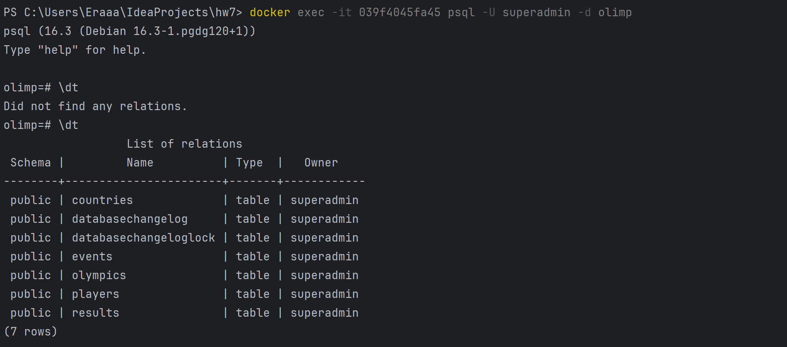
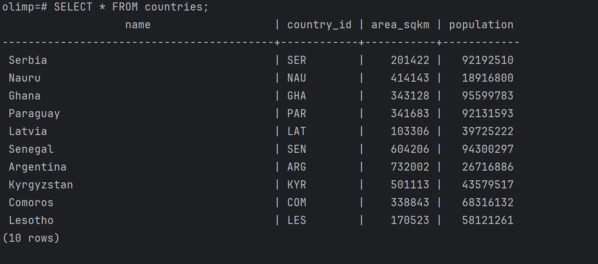

# Отчет:

_Требуется сделать:_

https://github.com/nemirlev/db_less_5_2024/blob/main/sql/olimp/1_init.sql

* Создать миграции, согласно схемы по ссылке выше
* Создать скрипт для автоматического наполнения базы данных (seeder). Если не нашли готовой библиотеки, можно написать свой класс, который будет использовать любую библиотеку/сервис faker. В метод передаете сколько в качестве параметра количество записей которые нужно создать в БД. На выходе получаем БД с фейковыми заполненными данными. 
* Выполнить задания с помощью ORM

### Миграции

Созданные миграции для таблиц, описанных в задании указана в папке `src/main/resources/db/changelog`

Миграция прямые и обратные сделаны с использованием liquibase и описаны в файле `db.master-changelor.yaml`

### Seeder
 
Скрипт для наполнения базы данных фейковыми данными находится в
папке `src/main/java/../seeder/DataSeeder.java`

В нем используется библиотека `JavaFaker` для генерации фейковых данных. Сами данные генерируются на подобие тех, что указаны в
sql файлах https://github.com/nemirlev/db_less_5_2024/blob/main/sql/olimp/

### ORM

Для ORM использовалась библиотека JPA, которая включена в зависимости проекта.

ORM сущности описаны в пакете `src/main/java/../entity` 

Репозитории для работы с сущностями описаны в пакете `src/main/java/../repository`, это базовые CrudRepository, 
обеспечивающие работу с сущностями.

Есть также DTO классы для специфичных запросов к базе данных, они описаны в пакете `src/main/java/../dto`

Скрин пустой БД до и после запуска приложения с миграциями и сидером:

10 строк, как и указано в DataSeeder:

